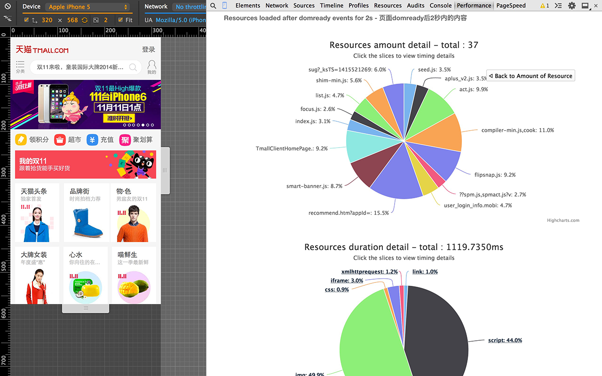

# Performance Inspector
<p>

</p>
## Why & Where

* Modern browsers supported API of performance but no extension for chrome that make user easy to see the result
* [Download from chrome apps](https://chrome.google.com/webstore/detail/performance-inspector/bgomfgoppmhcminmdojjeejheppadagh)，find in your develop tool tabs

## Build
* If you wanna to build a special version for yourself. Change data in folder `src` and run commands below in your terminal.
* `npm install`
* `gulp`
* Just a little operate of compress files~
* PS. you need to install [Node.js](http://nodejs.org)

## How
* Get data form inspected tab of performance and build charts for it
* Refresh page to get current data of performance after domfomplete event of Chrome

## More help
* As usual, **NO WORK** for websites of Google because some licenses of extension what I don't want to describe it here..
* [Leave a issue](https://github.com/ianli-sc/performanceInspector/issues) please

## License
* [WTFPL](http://en.wikipedia.org/wiki/WTFPL)

```
    DO WHAT THE FUCK YOU WANT TO PUBLIC LICENSE
                   Version 2, December 2004

Copyright (C) 2004 Sam Hocevar <sam@hocevar.net>

Everyone is permitted to copy and distribute verbatim or modified
copies of this license document, and changing it is allowed as long
as the name is changed.

           DO WHAT THE FUCK YOU WANT TO PUBLIC LICENSE
  TERMS AND CONDITIONS FOR COPYING, DISTRIBUTION AND MODIFICATION

 0. You just DO WHAT THE FUCK YOU WANT TO.

```